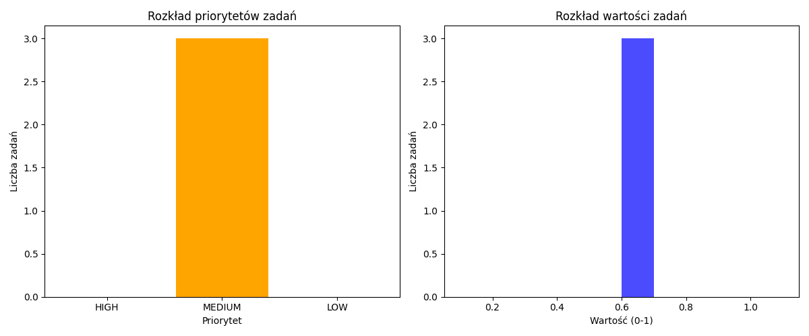

# Raport Dzienny - Development Assistant V2

**Data:** 2026-03-17 21:58:01

---

## 📊 Podsumowanie

- **Projekty:** 3
- **Problemy:** 0
- **Zadania:** 3
- **Stagnacja:** 0

## 📂 Projekty

- 📝 **content_bot**
- 📝 **scraper_1**
- 📝 **towarzysz**

## ⚠️ Problemy

✅ Brak problemów

## ✅ Zadania do wykonania

- 🟡 **content_bot**: Przeglądaj i aktualizuj kod
- 🟡 **scraper_1**: Przeglądaj i aktualizuj kod
- 🟡 **towarzysz**: Przeglądaj i aktualizuj kod

## 🕒 Stagnacja

✅ Brak stagnacji

---

> Wygenerowane automatycznie przez Development Assistant V2

[Otwórz dashboard interaktywny](charts/dashboard_2026-03-17.html)
