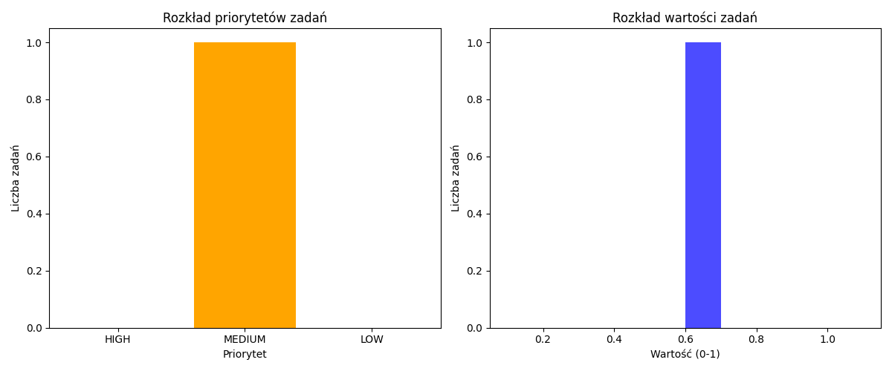

# Raport Dzienny - Development Assistant V2

**Data:** 2026-03-18 07:59:16

---

## 📊 Podsumowanie

- **Projekty:** 1
- **Problemy:** 0
- **Zadania:** 1
- **Stagnacja:** 0

## 📂 Projekty

- 📝 **test_project**

## ⚠️ Problemy

✅ Brak problemów

## ✅ Zadania do wykonania

- 🟡 **test_project**: Test task

## 🕒 Stagnacja

✅ Brak stagnacji

---

> Wygenerowane automatycznie przez Development Assistant V2

## ⏱️ Czas pracy

- **Czas całkowity:** 1.0 godz.
- **Czas per projekt:**
  - test_project: 1.0 godz.

[📄 Zobacz lekcję dnia](lessons/2026-03-18_lekcja.md)
